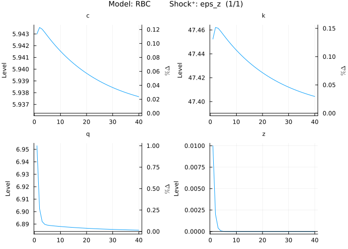

# MacroModelling.jl

**Documentation**: [](https://thorek1.github.io/MacroModelling.jl/stable)

[](https://codecov.io/gh/thorek1/MacroModelling.jl)
[](https://github.com/thorek1/MacroModelling.jl/actions/workflows/ci.yml)
[](https://doi.org/10.21105/joss.05598)
[](http://juliapkgstats.com/pkg/MacroModelling)
<!-- [](https://pkgs.genieframework.com?packages=MacroModelling) -->
<!-- [](https://zenodo.org/badge/latestdoi/571475096) -->
<!-- [](https://thorek1.github.io/MacroModelling.jl/dev) -->

**Author: Thore Kockerols (@thorek1)**

`MacroModelling.jl` is a Julia package for developing and solving dynamic stochastic general equilibrium (DSGE) models.

These kinds of models describe the behaviour of a macroeconomy and are particularly suited for counterfactual analysis (economic policy evaluation) and exploring / quantifying specific mechanisms (academic research). Due to the complexity of these models, efficient numerical tools are required, as analytical solutions are often unavailable. `MacroModelling.jl` serves as a tool for handling the complexities involved, such as forward-looking expectations, nonlinearity, and high dimensionality.

The goal of this package is to reduce coding time and speed up model development by providing functions for working with discrete-time DSGE models. The user-friendly syntax, automatic variable declaration, and effective steady state solver facilitate fast prototyping of models. Furthermore, the package allows the user to work with nonlinear model solutions (up to third order (pruned) perturbation) and estimate the model using gradient based samplers (e.g. NUTS, or HMC). Currently, `DifferentiableStateSpaceModels.jl` is the only other package providing functionality to estimate using gradient based samplers but they use the start-of-period timing convention instead of the end-of-period timing convention used in most other packages. The target audience for the package includes central bankers, regulators, graduate students, and others working in academia with an interest in DSGE modelling.

As of now the package can:

- parse a model written with user friendly syntax (variables are followed by time indices `...[2], [1], [0], [-1], [-2]...`, or `[x]` for shocks)
- (tries to) solve the model only knowing the model equations and parameter values (no steady state file needed)
- calculate **first, second, and third order (pruned) perturbation** solutions using symbolic derivatives
- handle **occasionally binding constraints** for linear and nonlinear solutions
- calculate (generalised) impulse response functions, simulate the model, or do conditional forecasts for linear and nonlinear solutions
- calibrate parameters using (non stochastic) steady state relationships
- **match model moments** (also for pruned **higher order** solutions)
- estimate the model on data (Kalman filter using first order perturbation) with **gradient based samplers** (e.g. NUTS, HMC) or **estimate nonlinear models** using the inversion filter
- **differentiate** (forward AD) the model solution, Kalman filter loglikelihood (forward and reverse-mode AD), model moments, steady state, **with respect to the parameters**

The package is not:

- guaranteed to find the non stochastic steady state (solving systems of nonlinear equations is an active area of research)
- the fastest package around if you already have a fast way to find the NSSS (time to first plot is long, time to second plot (with new parameters) is very short)

For more details have a look at the [documentation](https://thorek1.github.io/MacroModelling.jl/stable).

## Getting started

### Installation

`MacroModelling.jl` requires [`julia`](https://julialang.org/downloads/) version 1.10 or higher and an IDE is recommended (e.g. [`VS Code`](https://code.visualstudio.com/download) with the [`julia extension`](https://marketplace.visualstudio.com/items?itemName=julialang.language-julia)).

Once set up you can install `MacroModelling.jl` (and `StatsPlots` in order to plot) by typing the following in the Julia REPL:

```julia
using Pkg; Pkg.add(["MacroModelling", "StatsPlots"])
```

### Example

See below an implementation of a simple RBC model. You can find more detailed tutorials in the [documentation](https://thorek1.github.io/MacroModelling.jl/stable).

```julia
using MacroModelling
import StatsPlots

@model RBC begin
    1  /  c[0] = (β  /  c[1]) * (α * exp(z[1]) * k[0]^(α - 1) + (1 - δ))
    c[0] + k[0] = (1 - δ) * k[-1] + q[0]
    q[0] = exp(z[0]) * k[-1]^α
    z[0] = ρ * z[-1] + std_z * eps_z[x]
end;

@parameters RBC begin
    std_z = 0.01
    ρ = 0.2
    δ = 0.02
    α = 0.5
    β = 0.95
end;

plot_irf(RBC)
```



The package contains the following models in the `models` folder:

- [Aguiar and Gopinath (2007)](https://www.journals.uchicago.edu/doi/10.1086/511283) `Aguiar_Gopinath_2007.jl`
- [Ascari and Sbordone (2014)](https://www.aeaweb.org/articles?id=10.1257/jel.52.3.679) `Ascari_sbordone_2014.jl`
- [Backus, Kehoe, and Kydland (1992)](https://www.jstor.org/stable/2138686) `Backus_Kehoe_Kydland_1992`
- [Baxter and King (1993)](https://www.jstor.org/stable/2117521) `Baxter_King_1993.jl`
- [Caldara et al. (2012)](https://www.sciencedirect.com/science/article/abs/pii/S1094202511000433) `Caldara_et_al_2012.jl`
- [Gali (2015)](https://press.princeton.edu/books/hardcover/9780691164786/monetary-policy-inflation-and-the-business-cycle) - Chapter 3 `Gali_2015_chapter_3_nonlinear.jl`
- [Gali and Monacelli (2005)](https://crei.cat/wp-content/uploads/users/pages/roes8739.pdf) - CPI inflation-based Taylor rule `Gali_Monacelli_2005_CITR.jl`
- [Gerali, Neri, Sessa, and Signoretti (2010)](https://onlinelibrary.wiley.com/doi/abs/10.1111/j.1538-4616.2010.00331.x) `GNSS_2010.jl`
- [Ghironi and Melitz (2005)](https://faculty.washington.edu/ghiro/GhiroMeliQJE0805.pdf) `Ghironi_Melitz_2005.jl`
- [Ireland (2004)](http://irelandp.com/pubs/tshocksnk.pdf) `Ireland_2004.jl`
- [Jermann and Quadrini (2012)](https://www.aeaweb.org/articles?id=10.1257/aer.102.1.238) - RBC `JQ_2012_RBC.jl`
- [New Area-Wide Model (2008)](https://www.ecb.europa.eu/pub/pdf/scpwps/ecbwp944.pdf) - Euro Area - US `NAWM_EAUS_2008.jl`
- [QUEST3 (2009)](https://www.sciencedirect.com/science/article/abs/pii/S026499930800076X)  `QUEST3_2009.jl`
- [Schmitt-Grohé and Uribe (2003)](https://www.sciencedirect.com/science/article/abs/pii/S0022199602000569) - debt premium `SGU_2003_debt_premium.jl`
- [Schorfheide (2000)](https://onlinelibrary.wiley.com/doi/abs/10.1002/jae.582) `FS2000.jl`
- [Smets and Wouters (2003)](https://onlinelibrary.wiley.com/doi/10.1162/154247603770383415) `SW03.jl`
- [Smets and Wouters (2007)](https://www.aeaweb.org/articles?id=10.1257/aer.97.3.586) `SW07.jl`

## Comparison with other packages

||MacroModelling.jl|[dynare](https://www.dynare.org)|[DSGE.jl](https://github.com/FRBNY-DSGE/DSGE.jl)|[dolo.py](https://www.econforge.org/dolo.py/)|[SolveDSGE.jl](https://github.com/RJDennis/SolveDSGE.jl)|[DifferentiableStateSpaceModels.jl](https://github.com/HighDimensionalEconLab/DifferentiableStateSpaceModels.jl)|[StateSpaceEcon.jl](https://bankofcanada.github.io/DocsEcon.jl/dev/)|[IRIS](https://iris.igpmn.org)|[RISE](https://github.com/jmaih/RISE_toolbox)|[NBTOOLBOX](https://github.com/Coksp1/NBTOOLBOX/tree/main/Documentation)|[gEcon](http://gecon.r-forge.r-project.org)|[GDSGE](https://www.gdsge.com)|[Taylor Projection](https://sites.google.com/site/orenlevintal/taylor-projection)|
|---|---|---|---|---|---|---|---|---|---|---|---|---|---|
**Host language**|julia|MATLAB|julia|Python|julia|julia|julia|MATLAB|MATLAB|MATLAB|R|MATLAB|MATLAB|
**Non stochastic steady state solver**|*symbolic* or numerical solver of independent blocks; symbolic removal of variables redundant in steady state; inclusion of calibration equations in problem|numerical solver of independent blocks or user-supplied values/functions||numerical solver of independent blocks or user-supplied values/functions|numerical solver|numerical solver or user supplied values/equations|numerical solver of independent blocks or user-supplied values/functions|numerical solver of independent blocks or user-supplied values/functions|numerical solver of independent blocks or user-supplied values/functions|user-supplied steady state file or numerical solver|numerical solver; inclusion of calibration equations in problem|||
**Automatic declaration of variables and parameters**|yes|||||||||||||
**Derivatives wrt parameters**|yes|||||yes|||||||
**Perturbation solution order**|1, 2, 3|k|1|1, 2, 3|1, 2, 3|1, 2|1|1|1 to 5|1|1||1 to 5|
**Pruning**|yes|yes||||yes|||yes|||||
**Automatic derivation of first order conditions**|||||||||||yes||
**Occasionally binding constraints**|yes|yes|yes|yes|yes||||yes|||yes||
**Global solution**||||yes|yes|||||||yes||
**Estimation**|yes|yes|yes|||yes||yes|yes|yes|yes|||
**Balanced growth path**||yes|yes||||yes|yes|yes|yes|||||
**Model input**|macro (julia)|text file|text file|text file|text file|macro (julia)|module (julia)|text file|text file|text file|text file|text file|text file|
**Timing convention**|end-of-period|end-of-period||end-of-period|start-of-period|start-of-period|end-of-period|end-of-period|end-of-period|end-of-period|end-of-period|start-of-period|start-of-period|

## Bibliography

Andreasen, M. M., Fernández-Villaverde, J., and Rubio-Ramírez, J. F.  (2018), "The pruned state-space system for non-linear DSGE models: Theory and empirical applications.", The Review of Economic Studies, 85.1, p. 1-49.

Durbin, J, and Koopman, S. J. (2012), "Time Series Analysis by State Space Methods, 2nd edn", Oxford University Press.

Levintal, O., (2017), "Fifth-Order Perturbation Solution to DSGE models", Journal of Economic Dynamics and Control, 80, p. 1---16.

Villemot, S., (2011), "Solving rational expectations models at first order: what Dynare does", Dynare Working Papers 2, CEPREMAP.

## Questions and Contributions

If you have questions regarding the usage or encounter unexpected behaviour please file an issue.

Contributions are very welcome, as are feature requests and suggestions. Please open an issue or even better become a contributor and create a pull request.
