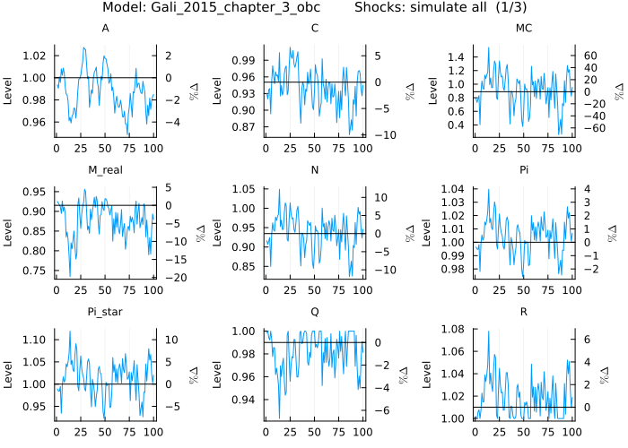
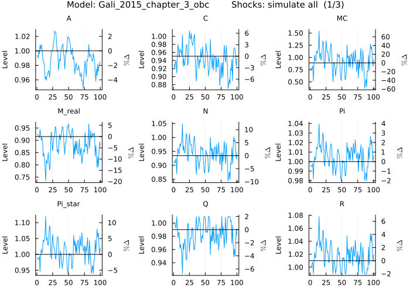
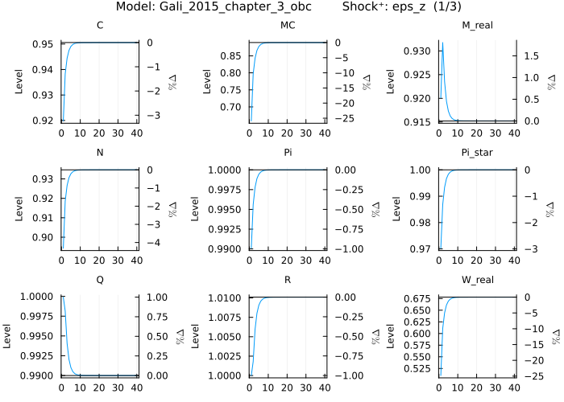
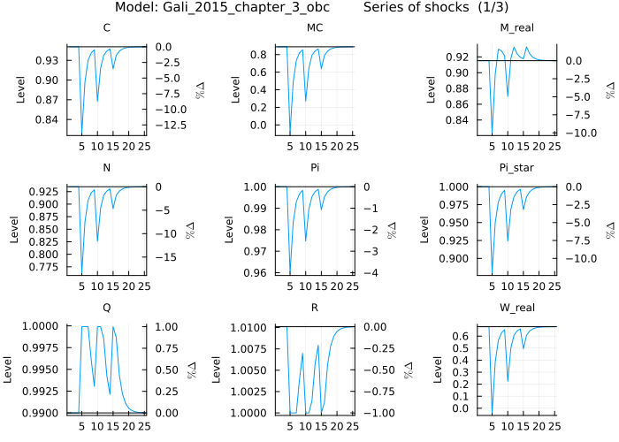
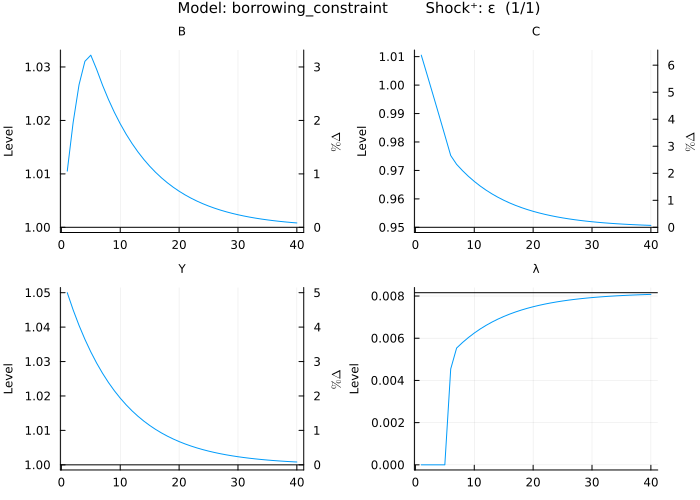
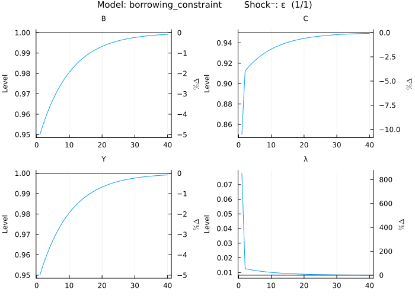
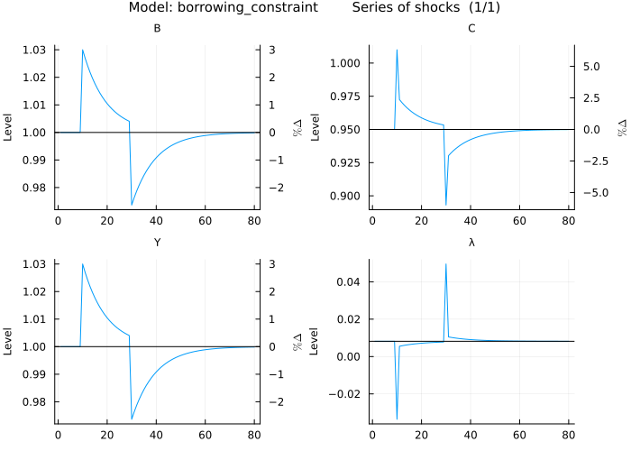

# Occasionally Binding Constraints

Occasionally binding constraints are a form of nonlinearity frequently used to model effects like the zero lower bound on interest rates, or borrowing constraints. Perturbation methods are not able to capture them as they are local approximations. Nonetheless, there are ways to combine the speed of perturbation solutions and the flexibility of occasionally binding constraints. `MacroModelling.jl` provides a convenient way to write down the constraints and automatically enforces the constraint equation with shocks. More specifically, the constraint equation is enforced for each periods unconditional forecast (default forecast horizon of 40 periods) by constraint equation specific anticipated shocks, while minimising the shock size.

This guide will demonstrate how to write down models containing occasionally binding constraints (e.g. effective lower bound and borrowing constraint), show some potential problems the user may encounter and how to overcome them, and go through some use cases.

Common problems that may occur are that no perturbation solution is found, or that the algorithm cannot find a combination of shocks which enforce the constraint equation. The former has to do with the fact that occasionally binding constraints can give rise to more than one steady state but only one is suitable for a perturbation solution. The latter has to do with the dynamics of the model and the fact that a finite amount of shocks is used to enforce the constraint equation.

Beyond the examples outlined in this guide there is a version of Smets and Wouters (2003) with the ELB in the models folder (filename: `SW03_obc.jl`).

## Example: Effective lower bound on interest rates

### Writing a model with occasionally binding constraints

Taking the [gali2015; Chapter 3](@citet) model containing a Taylor rule and implementing an effective lower bound on interest rates. The Taylor rule in the model: `R[0] = 1 / β * Pi[0] ^ ϕᵖⁱ * (Y[0] / Y[ss]) ^ ϕʸ * exp(nu[0])` needs to be modified so that `R[0]` never goes below an effective lower bound `R̄`. This can be done using the `max` operator: `R[0] = max(R̄ , 1 / β * Pi[0] ^ ϕᵖⁱ * (Y[0] / Y[ss]) ^ ϕʸ * exp(nu[0]))`

The model definition after the change of the Taylor rule looks like this:

```@setup howto_obc
ENV["GKSwstype"] = "100"
using Random
Random.seed!(30)
```

```@repl howto_obc
using MacroModelling
@model Gali_2015_chapter_3_obc begin
    W_real[0] = C[0] ^ σ * N[0] ^ φ

    Q[0] = β * (C[1] / C[0]) ^ (-σ) * Z[1] / Z[0] / Pi[1]

    R[0] = 1 / Q[0]

    Y[0] = A[0] * (N[0] / S[0]) ^ (1 - α)

    R[0] = Pi[1] * realinterest[0]

    C[0] = Y[0]

    log(A[0]) = ρ_a * log(A[-1]) + std_a * eps_a[x]

    log(Z[0]) = ρ_z * log(Z[-1]) - std_z * eps_z[x]

    nu[0] = ρ_ν * nu[-1] + std_nu * eps_nu[x]

    MC[0] = W_real[0] / (S[0] * Y[0] * (1 - α) / N[0])

    1 = θ * Pi[0] ^ (ϵ - 1) + (1 - θ) * Pi_star[0] ^ (1 - ϵ)

    S[0] = (1 - θ) * Pi_star[0] ^ (( - ϵ) / (1 - α)) + θ * Pi[0] ^ (ϵ / (1 - α)) * S[-1]

    Pi_star[0] ^ (1 + ϵ * α / (1 - α)) = ϵ * x_aux_1[0] / x_aux_2[0] * (1 - τ) / (ϵ - 1)

    x_aux_1[0] = MC[0] * Y[0] * Z[0] * C[0] ^ (-σ) + β * θ * Pi[1] ^ (ϵ + α * ϵ / (1 - α)) * x_aux_1[1]

    x_aux_2[0] = Y[0] * Z[0] * C[0] ^ (-σ) + β * θ * Pi[1] ^ (ϵ - 1) * x_aux_2[1]

    log_y[0] = log(Y[0])

    log_W_real[0] = log(W_real[0])

    log_N[0] = log(N[0])

    pi_ann[0] = 4 * log(Pi[0])

    i_ann[0] = 4 * log(R[0])

    r_real_ann[0] = 4 * log(realinterest[0])

    M_real[0] = Y[0] / R[0] ^ η

    R[0] = max(R̄ , 1 / β * Pi[0] ^ ϕᵖⁱ * (Y[0] / Y[ss]) ^ ϕʸ * exp(nu[0]))
end
```

In the background the system of equations is augmented by a series of anticipated shocks added to the equation containing the constraint (max/min operator). This explains the large number of auxiliary variables and shocks.

Next the parameters are defined including the new parameter defining the effective lower bound (which is set to 1, implementing a zero lower bound):

```@repl howto_obc
@parameters Gali_2015_chapter_3_obc begin
    R̄ = 1.0

    σ = 1

    φ = 5

    ϕᵖⁱ = 1.5

    ϕʸ = 0.125

    θ = 0.75

    ρ_ν = 0.5

    ρ_z = 0.5

    ρ_a = 0.9

    β = 0.99

    η = 3.77

    α = 0.25

    ϵ = 9

    τ = 0

    std_a = .01

    std_z = .05

    std_nu = .0025
end
```

### Verify the non-stochastic steady state

Let's check out the non-stochastic steady state (NSSS):

```@repl howto_obc
SS(Gali_2015_chapter_3_obc)
SS(Gali_2015_chapter_3_obc)(:R,:)
```

There are a few things to note here. First, the NSSS values of the auxiliary variables related to the occasionally binding constraint are shown. Second, the NSSS value of `R` is 1.010101, and thereby the effective lower bound (ELB) is not binding in the NSSS. If the ELB were not binding, then the NSSS would not be a viable approximation point for perturbation. A perturbation solution can only be found if the effective lower bound is not binding in NSSS. Calling `get_solution` reveals that there is a stable solution at this NSSS:

```@repl howto_obc
get_solution(Gali_2015_chapter_3_obc)
```

In case of a model or parameterisation that results in a NSSS where the ELB is binding, it is possible to add a restriction on the NSSS values so that the NSSS with binding ELB is excluded. With the above model, in order to exclude the non-viable NSSS the values of `R` needs to be restricted to be larger than the effective lower bound. This can be done by adding a constraint on the variable in the `@parameter` section. The model can be redefined:

```@repl howto_obc
@model Gali_2015_chapter_3_obc begin
    W_real[0] = C[0] ^ σ * N[0] ^ φ

    Q[0] = β * (C[1] / C[0]) ^ (-σ) * Z[1] / Z[0] / Pi[1]

    R[0] = 1 / Q[0]

    Y[0] = A[0] * (N[0] / S[0]) ^ (1 - α)

    R[0] = Pi[1] * realinterest[0]

    C[0] = Y[0]

    log(A[0]) = ρ_a * log(A[-1]) + std_a * eps_a[x]

    log(Z[0]) = ρ_z * log(Z[-1]) - std_z * eps_z[x]

    nu[0] = ρ_ν * nu[-1] + std_nu * eps_nu[x]

    MC[0] = W_real[0] / (S[0] * Y[0] * (1 - α) / N[0])

    1 = θ * Pi[0] ^ (ϵ - 1) + (1 - θ) * Pi_star[0] ^ (1 - ϵ)

    S[0] = (1 - θ) * Pi_star[0] ^ (( - ϵ) / (1 - α)) + θ * Pi[0] ^ (ϵ / (1 - α)) * S[-1]

    Pi_star[0] ^ (1 + ϵ * α / (1 - α)) = ϵ * x_aux_1[0] / x_aux_2[0] * (1 - τ) / (ϵ - 1)

    x_aux_1[0] = MC[0] * Y[0] * Z[0] * C[0] ^ (-σ) + β * θ * Pi[1] ^ (ϵ + α * ϵ / (1 - α)) * x_aux_1[1]

    x_aux_2[0] = Y[0] * Z[0] * C[0] ^ (-σ) + β * θ * Pi[1] ^ (ϵ - 1) * x_aux_2[1]

    log_y[0] = log(Y[0])

    log_W_real[0] = log(W_real[0])

    log_N[0] = log(N[0])

    pi_ann[0] = 4 * log(Pi[0])

    i_ann[0] = 4 * log(R[0])

    r_real_ann[0] = 4 * log(realinterest[0])

    M_real[0] = Y[0] / R[0] ^ η

    R[0] = max(R̄ , 1 / β * Pi[0] ^ ϕᵖⁱ * (Y[0] / Y[ss]) ^ ϕʸ * exp(nu[0]))
end

@parameters Gali_2015_chapter_3_obc begin
    R̄ = 1.0

    σ = 1

    φ = 5

    ϕᵖⁱ = 1.5

    ϕʸ = 0.125

    θ = 0.75

    ρ_ν = 0.5

    ρ_z = 0.5

    ρ_a = 0.9

    β = 0.99

    η = 3.77

    α = 0.25

    ϵ = 9

    τ = 0

    std_a = .01

    std_z = .05

    std_nu = .0025

    R > 1.000001
end
```

and check the NSSS once more:

```@repl howto_obc
SS(Gali_2015_chapter_3_obc)
SS(Gali_2015_chapter_3_obc)(:R,:)
```

Now `R > R̄` is obtained, so that the constraint is not binding in the NSSS and a stable first order solution can be used:

```@repl howto_obc
get_solution(Gali_2015_chapter_3_obc)
```

### Generate model output

Having defined the system with an occasionally binding constraint the model can simply be simulated by calling:

```@repl howto_obc
import StatsPlots
import Random
Random.seed!(20)
plot_simulations(Gali_2015_chapter_3_obc)
```



In the background an optimisation problem is set up to find the smallest shocks in magnitude which enforce the equation containing the occasionally binding constraint over the unconditional forecast horizon (default 40 periods) at each period of the simulation. The plots show multiple spells of a binding effective lower bound and many other variables are skewed as a result of the nonlinearity. It can happen that it is not possible to find a combination of shocks which enforce the occasionally binding constraint equation. In this case one solution can be to make the horizon larger over which the algorithm tries to enforce the equation. This can be done by setting the parameter at the beginning of the `@model` section: `@model Gali_2015_chapter_3_obc max_obc_horizon = 60 begin ... end`.

Next the effective lower bound will be changed to `0.99` and plotted once more:

```@repl howto_obc
Random.seed!(20)
plot_simulations(Gali_2015_chapter_3_obc, parameters = :R̄ => 0.99)
```



Now, the effect of the effective lower bound becomes less important as it binds less often.

If the occasionally binding constraint should be ignored simply call:

```@repl howto_obc
Random.seed!(20)
plot_simulations(Gali_2015_chapter_3_obc, ignore_obc = true)
```


and the simulation is based on the first order solution approximated around the NSSS, which is the same as the one for the model without the modified Taylor rule.

The impulse response functions can be plotted for the `eps_z` shock, while setting the parameter of the occasionally binding constraint back to `1`, as follows:

```@repl howto_obc
plot_irf(Gali_2015_chapter_3_obc, shocks = :eps_z, parameters = :R̄ => 1.0)
```



As can be seen `R` remains above the effective lower bound in the first period.

Next, the model is simulated using a series of shocks. E.g. three positive shocks to `eps_z` in periods 5, 10, and 15 in decreasing magnitude:

```@repl howto_obc
shcks = zeros(1,15)
shcks[5] =  3.0
shcks[10] = 2.0
shcks[15] = 1.0

sks = KeyedArray(shcks;  Shocks = [:eps_z], Periods = 1:15)  # KeyedArray is provided by the `AxisKeys` package

plot_irf(Gali_2015_chapter_3_obc, 
            shocks = sks, 
            periods = 10)
```



The effective lower bound is binding after all three shocks but the length of the constraint being binding varies with the shock size and is completely endogenous.

Last but not least, the simulated moments of the model can be obtained (theoretical moments are not available):

```@repl howto_obc
Random.seed!(922)
sims = get_irf(Gali_2015_chapter_3_obc, 
                parameters = :R̄ => 0.99, 
                periods = 500, 
                shocks = :simulate, 
                levels = true)
```

The mean and standard deviation of output can be examined:

```@repl howto_obc
import Statistics
Statistics.mean(sims(:Y,:,:))
```

and

```@repl howto_obc
Statistics.std(sims(:Y,:,:))
```

Compare this to the theoretical mean of the model without the occasionally binding constraint:

```@repl howto_obc
get_mean(Gali_2015_chapter_3_obc)
get_mean(Gali_2015_chapter_3_obc)(:Y,:)
```

and the theoretical standard deviation:

```@repl howto_obc
get_std(Gali_2015_chapter_3_obc)
get_std(Gali_2015_chapter_3_obc)(:Y,:)
```

The mean of output is lower in the model with effective lower bound compared to the model without and the standard deviation is higher.

## Example: Borrowing constraint

### Model definition

Starting with a consumption-saving model containing a borrowing constraint (see [@citet cuba2019likelihood] for details). Output is exogenously given, and households can only borrow up to a fraction of output and decide between saving and consumption. The first order conditions of the model are:

```math
\begin{align*}
Y_t + B_t &= C_t + R \, B_{t-1}\\
\log(Y_t) &= \rho \, \log(Y_{t-1}) + \sigma \, \varepsilon_t\\
C_t^{-\gamma} &= \beta \, R \, \mathbb{E}_t (C_{t+1}^{-\gamma}) + \lambda_t\\
0 &= \lambda_t \, (B_t - mY_t)
\end{align*}
```

in order to write this model down the Karush-Kuhn-Tucker condition (last equation) needs to be expressed using a max (or min) operator, so that it becomes:

```math
0 = \max(B_t - mY_t, -\lambda_t)
```

This model containing an occasionally binding constraint can be written in a very convenient way:

```@repl howto_obc
@model borrowing_constraint begin
    Y[0] + B[0] = C[0] + R * B[-1]

    log(Y[0]) = ρ * log(Y[-1]) + σ * ε[x]

    C[0]^(-γ) = β * R * C[1]^(-γ) + λ[0]

    0 = max(B[0] - m * Y[0], -λ[0])
end
```

In the background the system of equations is augmented by a series of anticipated shocks added to the equation containing the constraint (max/min operator). This explains the large number of auxiliary variables and shocks.

Next the parameters are defined as usual:

```@repl howto_obc
@parameters borrowing_constraint begin
    R = 1.05
    β = 0.945
    ρ = 0.9
    σ = 0.05
    m = 1
    γ = 1
end
```

### Working with the model

For the non-stochastic steady state (NSSS) to exist the constraint has to be binding (`B[0] = m * Y[0]`). This implies a wedge in the Euler equation (`λ > 0`).

This can be checked by getting the NSSS:

```@repl howto_obc
SS(borrowing_constraint)
```

A common task is to plot impulse response functions for positive and negative shocks. This should allow understanding the role of the constraint.

First, the StatsPlots package needs to be imported and then the positive shock can be plotted.

```@repl howto_obc
import StatsPlots
plot_irf(borrowing_constraint)
```



The constraint is no longer binding in the first five periods because `Y` and `B` do not increase by the same amount. They should move by the same amount in the case of a negative shock:

```@repl howto_obc
import StatsPlots
plot_irf(borrowing_constraint, negative_shock = true)
```



and indeed in this case they move by the same amount. The difference between a positive and negative shock demonstrates the influence of the occasionally binding constraint.

Another common exercise is to plot the impulse response functions from a series of shocks. Assuming in period 10 there is a positive shock and in period 30 a negative one, and viewing the results for 50 more periods, this can be done as follows:

```@repl howto_obc
shcks = zeros(1,30)
shcks[10] =  .6
shcks[30] = -.6

sks = KeyedArray(shcks;  Shocks = [:ε], Periods = 1:30)  # KeyedArray is provided by the `AxisKeys` package

plot_irf(borrowing_constraint, shocks = sks, periods = 50)
```


In this case the difference between the shocks and the impact of the constraint become quite obvious. Comparing this with a version of the model that ignores the occasionally binding constraint, in order to plot the impulse response functions without dynamically enforcing the constraint simply write:

```@repl howto_obc
plot_irf(borrowing_constraint, shocks = sks, periods = 50, ignore_obc = true)
```



Another interesting statistic is model moments. As there are no theoretical moments reliance on simulated data is necessary:

```@repl howto_obc
Random.seed!(17339053787832050337)
sims = get_irf(borrowing_constraint, 
                periods = 300, 
                shocks = :simulate, 
                levels = true)
```

Let's look at the mean and standard deviation of borrowing:

```@repl howto_obc
import Statistics
Statistics.mean(sims(:B,:,:))
```

and

```@repl howto_obc
Statistics.std(sims(:B,:,:))
```

Compare this to the theoretical mean of the model without the occasionally binding constraint:

```@repl howto_obc
get_mean(borrowing_constraint)
```

and the theoretical standard deviation:

```@repl howto_obc
get_std(borrowing_constraint)
```

The mean and standard deviation of borrowing is lower in the model with occasionally binding constraints compared to the model without.
