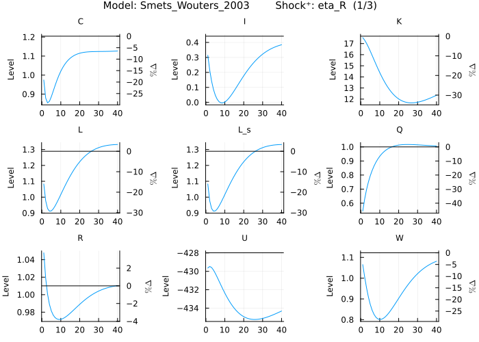
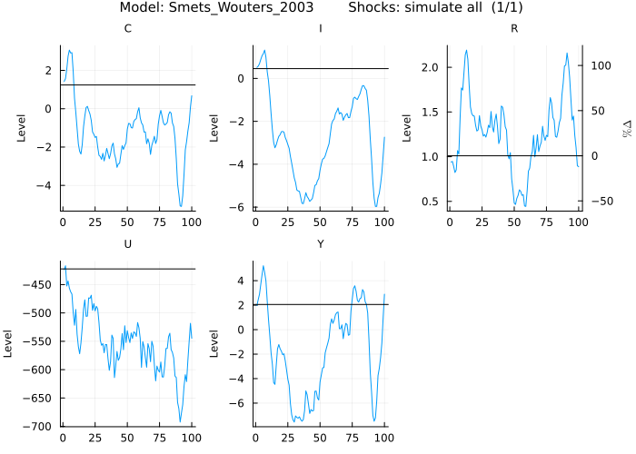
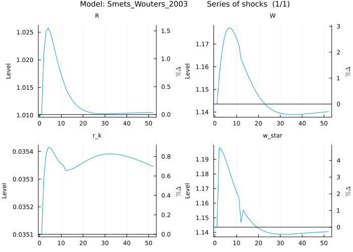
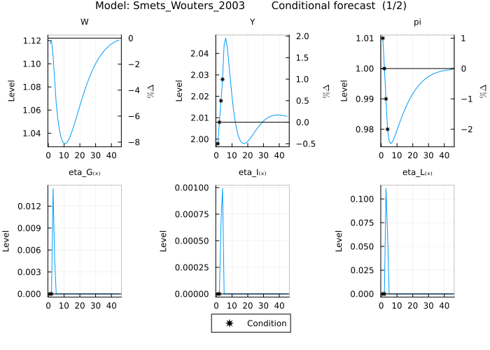
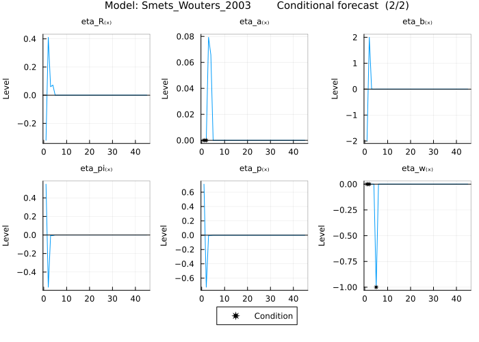

# Work with a complex model - Smets and Wouters (2003)

This tutorial is intended to show more advanced features of the package which come into play with more complex models. The tutorial will walk through the same steps as for the simple RBC model but will use the nonlinear [smetswouters2003](@citet) model instead. Prior knowledge of DSGE models and their solution in practical terms (e.g. having used a mod file with dynare) is useful in understanding this tutorial.

## Define the model

The first step is always to name the model and write down the equations. For the [smetswouters2003](@citet) model this would go as follows:

```@setup tutorial_2
ENV["GKSwstype"] = "100"
```

```@repl tutorial_2
using MacroModelling
@model Smets_Wouters_2003 begin
    -q[0] + beta * ((1 - tau) * q[1] + epsilon_b[1] * (r_k[1] * z[1] - psi^-1 * r_k[ss] * (-1 + exp(psi * (-1 + z[1])))) * (C[1] - h * C[0])^(-sigma_c))
    -q_f[0] + beta * ((1 - tau) * q_f[1] + epsilon_b[1] * (r_k_f[1] * z_f[1] - psi^-1 * r_k_f[ss] * (-1 + exp(psi * (-1 + z_f[1])))) * (C_f[1] - h * C_f[0])^(-sigma_c))
    -r_k[0] + alpha * epsilon_a[0] * mc[0] * L[0]^(1 - alpha) * (K[-1] * z[0])^(-1 + alpha)
    -r_k_f[0] + alpha * epsilon_a[0] * mc_f[0] * L_f[0]^(1 - alpha) * (K_f[-1] * z_f[0])^(-1 + alpha)
    -G[0] + T[0]
    -G[0] + G_bar * epsilon_G[0]
    -G_f[0] + T_f[0]
    -G_f[0] + G_bar * epsilon_G[0]
    -L[0] + nu_w[0]^-1 * L_s[0]
    -L_s_f[0] + L_f[0] * (W_i_f[0] * W_f[0]^-1)^(lambda_w^-1 * (-1 - lambda_w))
    L_s_f[0] - L_f[0]
    L_s_f[0] + lambda_w^-1 * L_f[0] * W_f[0]^-1 * (-1 - lambda_w) * (-W_disutil_f[0] + W_i_f[0]) * (W_i_f[0] * W_f[0]^-1)^(-1 + lambda_w^-1 * (-1 - lambda_w))
    Pi_ws_f[0] - L_s_f[0] * (-W_disutil_f[0] + W_i_f[0])
    Pi_ps_f[0] - Y_f[0] * (-mc_f[0] + P_j_f[0]) * P_j_f[0]^(-lambda_p^-1 * (1 + lambda_p))
    -Q[0] + epsilon_b[0]^-1 * q[0] * (C[0] - h * C[-1])^(sigma_c)
    -Q_f[0] + epsilon_b[0]^-1 * q_f[0] * (C_f[0] - h * C_f[-1])^(sigma_c)
    -W[0] + epsilon_a[0] * mc[0] * (1 - alpha) * L[0]^(-alpha) * (K[-1] * z[0])^alpha
    -W_f[0] + epsilon_a[0] * mc_f[0] * (1 - alpha) * L_f[0]^(-alpha) * (K_f[-1] * z_f[0])^alpha
    -Y_f[0] + Y_s_f[0]
    Y_s[0] - nu_p[0] * Y[0]
    -Y_s_f[0] + Y_f[0] * P_j_f[0]^(-lambda_p^-1 * (1 + lambda_p))
    beta * epsilon_b[1] * (C_f[1] - h * C_f[0])^(-sigma_c) - epsilon_b[0] * R_f[0]^-1 * (C_f[0] - h * C_f[-1])^(-sigma_c)
    beta * epsilon_b[1] * pi[1]^-1 * (C[1] - h * C[0])^(-sigma_c) - epsilon_b[0] * R[0]^-1 * (C[0] - h * C[-1])^(-sigma_c)
    Y_f[0] * P_j_f[0]^(-lambda_p^-1 * (1 + lambda_p)) - lambda_p^-1 * Y_f[0] * (1 + lambda_p) * (-mc_f[0] + P_j_f[0]) * P_j_f[0]^(-1 - lambda_p^-1 * (1 + lambda_p))
    epsilon_b[0] * W_disutil_f[0] * (C_f[0] - h * C_f[-1])^(-sigma_c) - omega * epsilon_b[0] * epsilon_L[0] * L_s_f[0]^sigma_l
    -1 + xi_p * (pi[0]^-1 * pi[-1]^gamma_p)^(-lambda_p^-1) + (1 - xi_p) * pi_star[0]^(-lambda_p^-1)
    -1 + (1 - xi_w) * (w_star[0] * W[0]^-1)^(-lambda_w^-1) + xi_w * (W[-1] * W[0]^-1)^(-lambda_w^-1) * (pi[0]^-1 * pi[-1]^gamma_w)^(-lambda_w^-1)
    -Phi - Y_s[0] + epsilon_a[0] * L[0]^(1 - alpha) * (K[-1] * z[0])^alpha
    -Phi - Y_f[0] * P_j_f[0]^(-lambda_p^-1 * (1 + lambda_p)) + epsilon_a[0] * L_f[0]^(1 - alpha) * (K_f[-1] * z_f[0])^alpha
    std_eta_b * eta_b[x] - log(epsilon_b[0]) + rho_b * log(epsilon_b[-1])
    -std_eta_L * eta_L[x] - log(epsilon_L[0]) + rho_L * log(epsilon_L[-1])
    std_eta_I * eta_I[x] - log(epsilon_I[0]) + rho_I * log(epsilon_I[-1])
    std_eta_w * eta_w[x] - f_1[0] + f_2[0]
    std_eta_a * eta_a[x] - log(epsilon_a[0]) + rho_a * log(epsilon_a[-1])
    std_eta_p * eta_p[x] - g_1[0] + g_2[0] * (1 + lambda_p)
    std_eta_G * eta_G[x] - log(epsilon_G[0]) + rho_G * log(epsilon_G[-1])
    -f_1[0] + beta * xi_w * f_1[1] * (w_star[0]^-1 * w_star[1])^(lambda_w^-1) * (pi[1]^-1 * pi[0]^gamma_w)^(-lambda_w^-1) + epsilon_b[0] * w_star[0] * L[0] * (1 + lambda_w)^-1 * (C[0] - h * C[-1])^(-sigma_c) * (w_star[0] * W[0]^-1)^(-lambda_w^-1 * (1 + lambda_w))
    -f_2[0] + beta * xi_w * f_2[1] * (w_star[0]^-1 * w_star[1])^(lambda_w^-1 * (1 + lambda_w) * (1 + sigma_l)) * (pi[1]^-1 * pi[0]^gamma_w)^(-lambda_w^-1 * (1 + lambda_w) * (1 + sigma_l)) + omega * epsilon_b[0] * epsilon_L[0] * (L[0] * (w_star[0] * W[0]^-1)^(-lambda_w^-1 * (1 + lambda_w)))^(1 + sigma_l)
    -g_1[0] + beta * xi_p * pi_star[0] * g_1[1] * pi_star[1]^-1 * (pi[1]^-1 * pi[0]^gamma_p)^(-lambda_p^-1) + epsilon_b[0] * pi_star[0] * Y[0] * (C[0] - h * C[-1])^(-sigma_c)
    -g_2[0] + beta * xi_p * g_2[1] * (pi[1]^-1 * pi[0]^gamma_p)^(-lambda_p^-1 * (1 + lambda_p)) + epsilon_b[0] * mc[0] * Y[0] * (C[0] - h * C[-1])^(-sigma_c)
    -nu_w[0] + (1 - xi_w) * (w_star[0] * W[0]^-1)^(-lambda_w^-1 * (1 + lambda_w)) + xi_w * nu_w[-1] * (W[-1] * pi[0]^-1 * W[0]^-1 * pi[-1]^gamma_w)^(-lambda_w^-1 * (1 + lambda_w))
    -nu_p[0] + (1 - xi_p) * pi_star[0]^(-lambda_p^-1 * (1 + lambda_p)) + xi_p * nu_p[-1] * (pi[0]^-1 * pi[-1]^gamma_p)^(-lambda_p^-1 * (1 + lambda_p))
    -K[0] + K[-1] * (1 - tau) + I[0] * (1 - 0.5 * varphi * (-1 + I[-1]^-1 * epsilon_I[0] * I[0])^2)
    -K_f[0] + K_f[-1] * (1 - tau) + I_f[0] * (1 - 0.5 * varphi * (-1 + I_f[-1]^-1 * epsilon_I[0] * I_f[0])^2)
    U[0] - beta * U[1] - epsilon_b[0] * ((1 - sigma_c)^-1 * (C[0] - h * C[-1])^(1 - sigma_c) - omega * epsilon_L[0] * (1 + sigma_l)^-1 * L_s[0]^(1 + sigma_l))
    U_f[0] - beta * U_f[1] - epsilon_b[0] * ((1 - sigma_c)^-1 * (C_f[0] - h * C_f[-1])^(1 - sigma_c) - omega * epsilon_L[0] * (1 + sigma_l)^-1 * L_s_f[0]^(1 + sigma_l))
    -epsilon_b[0] * (C[0] - h * C[-1])^(-sigma_c) + q[0] * (1 - 0.5 * varphi * (-1 + I[-1]^-1 * epsilon_I[0] * I[0])^2 - varphi * I[-1]^-1 * epsilon_I[0] * I[0] * (-1 + I[-1]^-1 * epsilon_I[0] * I[0])) + beta * varphi * I[0]^-2 * epsilon_I[1] * q[1] * I[1]^2 * (-1 + I[0]^-1 * epsilon_I[1] * I[1])
    -epsilon_b[0] * (C_f[0] - h * C_f[-1])^(-sigma_c) + q_f[0] * (1 - 0.5 * varphi * (-1 + I_f[-1]^-1 * epsilon_I[0] * I_f[0])^2 - varphi * I_f[-1]^-1 * epsilon_I[0] * I_f[0] * (-1 + I_f[-1]^-1 * epsilon_I[0] * I_f[0])) + beta * varphi * I_f[0]^-2 * epsilon_I[1] * q_f[1] * I_f[1]^2 * (-1 + I_f[0]^-1 * epsilon_I[1] * I_f[1])
    std_eta_pi * eta_pi[x] - log(pi_obj[0]) + rho_pi_bar * log(pi_obj[-1]) + log(calibr_pi_obj) * (1 - rho_pi_bar)
    -C[0] - I[0] - T[0] + Y[0] - psi^-1 * r_k[ss] * K[-1] * (-1 + exp(psi * (-1 + z[0])))
    -calibr_pi + std_eta_R * eta_R[x] - log(R[ss]^-1 * R[0]) + r_Delta_pi * (-log(pi[ss]^-1 * pi[-1]) + log(pi[ss]^-1 * pi[0])) + r_Delta_y * (-log(Y[ss]^-1 * Y[-1]) + log(Y[ss]^-1 * Y[0]) + log(Y_f[ss]^-1 * Y_f[-1]) - log(Y_f[ss]^-1 * Y_f[0])) + rho * log(R[ss]^-1 * R[-1]) + (1 - rho) * (log(pi_obj[0]) + r_pi * (-log(pi_obj[0]) + log(pi[ss]^-1 * pi[-1])) + r_Y * (log(Y[ss]^-1 * Y[0]) - log(Y_f[ss]^-1 * Y_f[0])))
    -C_f[0] - I_f[0] + Pi_ws_f[0] - T_f[0] + Y_f[0] + L_s_f[0] * W_disutil_f[0] - L_f[0] * W_f[0] - psi^-1 * r_k_f[ss] * K_f[-1] * (-1 + exp(psi * (-1 + z_f[0])))
    epsilon_b[0] * (K[-1] * r_k[0] - r_k[ss] * K[-1] * exp(psi * (-1 + z[0]))) * (C[0] - h * C[-1])^(-sigma_c)
    epsilon_b[0] * (K_f[-1] * r_k_f[0] - r_k_f[ss] * K_f[-1] * exp(psi * (-1 + z_f[0]))) * (C_f[0] - h * C_f[-1])^(-sigma_c)
end
```

First, the package is loaded and then the [`@model`](@ref) macro is used to define the model. The first argument after [`@model`](@ref) is the model name and will be the name of the object in the global environment containing all information regarding the model. The second argument to the macro are the equations, which are written down between begin and end. Equations can contain an equality sign or the expression is assumed to equal 0. Equations cannot span multiple lines (unless the expression is wrapped in brackets) and the timing of endogenous variables are expressed in the square brackets following the variable name (e.g. `[-1]` for the past period). Exogenous variables (shocks) are followed by a keyword in square brackets indicating them being exogenous (in this case [x]). In this example there are also variables in the non-stochastic steady state denoted by `[ss]`. Note that names can leverage julia's unicode capabilities (alpha can be written as α).

## Define the parameters

Next the parameters of the model need to be added. The macro [`@parameters`](@ref) takes care of this:

```@repl tutorial_2
@parameters Smets_Wouters_2003 begin  
    lambda_p = .368
    G_bar = .362
    lambda_w = 0.5
    Phi = .819

    alpha = 0.3
    beta = 0.99
    gamma_w = 0.763
    gamma_p = 0.469
    h = 0.573
    omega = 1
    psi = 0.169

    r_pi = 1.684
    r_Y = 0.099
    r_Delta_pi = 0.14
    r_Delta_y = 0.159

    sigma_c = 1.353
    sigma_l = 2.4
    tau = 0.025
    varphi = 6.771
    xi_w = 0.737
    xi_p = 0.908

    rho = 0.961
    rho_b = 0.855
    rho_L = 0.889
    rho_I = 0.927
    rho_a = 0.823
    rho_G = 0.949
    rho_pi_bar = 0.924

    std_eta_b = 0.336
    std_eta_L = 3.52
    std_eta_I = 0.085
    std_eta_a = 0.598
    std_eta_w = 0.6853261
    std_eta_p = 0.7896512
    std_eta_G = 0.325
    std_eta_R = 0.081
    std_eta_pi = 0.017

    calibr_pi_obj | 1 = pi_obj[ss]
    calibr_pi | pi[ss] = pi_obj[ss]
end
```

The block defining the parameters above has two different inputs.

First, there are simple parameter definition the same way values are assigned (e.g. `Phi = .819`).

Second, there are calibration equations where the value of a parameter is treated as unknown (e.g. `calibr_pi_obj`) and an additional equation is required to hold (e.g. `1 = pi_obj[ss]`). The additional equation can contain variables in SS or parameters. Putting it together a calibration equation is defined by the unknown parameter, and the calibration equation, separated by `|` (e.g. `calibr_pi_obj | 1 = pi_obj[ss]` and also `1 = pi_obj[ss] | calibr_pi_obj`).

Note that one parameter definition per line is required.

Given the equations and parameters, the package will first attempt to solve the system of nonlinear equations symbolically (including possible calibration equations). If an analytical solution is not possible, numerical solution methods are used to try and solve it. There is no guarantee that a solution can be found, but it is highly likely, given that a solution exists. The problem setup tries to incorporate parts of the structure of the problem, e.g. bounds on variables: if one equation contains `log(k)` it must be that `k > 0`. Nonetheless, the user can also provide useful information such as variable bounds or initial guesses. Bounds can be set by adding another expression to the parameter block e.g.: `c > 0`. Large values are typically a problem for numerical solvers. Therefore, providing a guess for these values will increase the speed of the solver. Guesses can be provided as a `Dict` after the model name and before the parameter definitions block, e.g.: `@parameters Smets_Wouters_2003 guess = Dict(k => 10) begin ... end`.

## Plot impulse response functions (IRFs)

A useful output to analyse are IRFs for the exogenous shocks. Calling [`plot_irf`](@ref) (different names for the same function are also supported: [`plot_irfs`](@ref), or [`plot_IRF`](@ref)) will take care of this. Note that the `StatsPlots` package needs to be imported once before the first plot. In the background the package solves (numerically in this complex case) for the non-stochastic steady state (SS) and calculates the first order perturbation solution.

```@repl tutorial_2
import StatsPlots
plot_irf(Smets_Wouters_2003)
```



When the model is solved the first time (in this case by calling [`plot_irf`](@ref)), the package breaks down the steady state problem into independent blocks and first attempts to solve them symbolically and if that fails numerically.

The plots show the responses of the endogenous variables to a one standard deviation positive (indicated by Shock⁺ in chart title) unanticipated shock. Therefore there are as many subplots as there are combinations of shocks and endogenous variables (which are impacted by the shock). Plots are composed of up to 9 subplots and the plot title shows the model name followed by the name of the shock and which plot is shown out of the plots for this shock (e.g. (1/3) means the first out of three plots for this shock). Subplots show the sorted endogenous variables with the left y-axis showing the level of the respective variable and the right y-axis showing the percent deviation from the SS (if variable is strictly positive). The horizontal black line marks the SS.

## Explore other parameter values

Playing around with the model can be especially insightful in the early phase of model development. The package tries to facilitate this process to the extent possible. Typically different parameter values are tried to see how the IRFs change. This can be done by using the `parameters` argument of the [`plot_irf`](@ref) function. Pass a `Pair` with the `Symbol` of the parameter (`:` in front of the parameter name) that should change and its new value to the `parameter` argument (e.g. `:alpha => 0.305`). Furthermore, the example focuses on certain shocks and variables. The `eta_R` shock is selected by passing it as a `Symbol` to the `shocks` argument. The variables plotted are `U`, `Y`, `I`, `R`, and `C`, achieved by passing the `Vector` of `Symbol`s to the `variables` argument of the [`plot_irf`](@ref) function:

```@repl tutorial_2
plot_irf(Smets_Wouters_2003, 
         parameters = :alpha => 0.305, 
         variables = [:U,:Y,:I,:R,:C], 
         shocks = :eta_R)
```


First, the package finds the new steady state, solves the model dynamics around it and saves the new parameters and solution in the model object. Second, note that with the parameters the IRFs changed (e.g. compare the y-axis values for `U`). Updating the plot for new parameters is significantly faster than calling it the first time. This is because the first call triggers compilations of the model functions, and once compiled the user benefits from the performance of the specialised compiled code. Furthermore, finding the SS from a valid SS as a starting point is faster.

## Plot model simulation

Another insightful output is simulations of the model. The [`plot_simulations`](@ref) function can be used here. Again only a subset of the variables will be examined and specified in the `variables` argument. Note that the `StatsPlots` package needs to be imported once before the first plot. To the same effect the [`plot_irf`](@ref) function can be used and in the `shocks` argument `:simulate` is specified to simulate the model and the `periods` argument set to 100.

```@repl tutorial_2
plot_simulations(Smets_Wouters_2003, variables = [:U,:Y,:I,:R,:C])
```



The plots show the models endogenous variables in response to random draws for all exogenous shocks over 100 periods.

## Plot specific series of shocks

Sometimes a specific series of shocks is of interest and the corresponding responses of the endogenous variables can be examined by passing a `Matrix` or a `KeyedArray` (the `KeyedArray` type is provided by the `AxisKeys` package) of shock series to the `shocks` argument of the `plot_irf` function. For example, consider a positive 1 standard deviation shock to `eta_b` in period 2 and a negative 1 standard deviation shock to `eta_w` in period 12. This can be implemented as follows:

```@repl tutorial_2
using AxisKeys
shock_series = KeyedArray(zeros(2,12), Shocks = [:eta_b, :eta_w], Periods = 1:12)
shock_series[1,2] = 1
shock_series[2,12] = -1
plot_irf(Smets_Wouters_2003, shocks = shock_series, variables = [:W,:r_k,:w_star,:R])
```



First, the `KeyedArray` (provided by the `AxisKeys` package) containing the series of shocks is constructed and passed to the `shocks` argument.
The plot shows the paths of the selected variables for the two shocks hitting the economy in periods 2 and 12 and 40 quarters thereafter.

## Model statistics

### Steady state

The package solves for the SS automatically and the SS values can be seen in the plots. To see the SS values and the derivatives of the SS with respect to the model parameters [`get_steady_state`](@ref) can be called. The model has 39 parameters and 54 variables. Since not all derivatives for all parameters are of interest a subset is selected. This can be done by passing on a `Vector` of `Symbol`s of the parameters to the `parameter_derivatives` argument:

```@repl tutorial_2
get_steady_state(Smets_Wouters_2003, parameter_derivatives = [:alpha,:beta])
```

The first column of the returned matrix shows the SS while the second to last columns show the derivatives of the SS values (indicated in the rows) with respect to the parameters (indicated in the columns). For example, the derivative of `C` with respect to `beta` is 14.4994. This means that if `beta` is increased by 1, `C` would increase by 14.4994 approximately. How this plays out can be seen by changing `beta` from 0.99 to 0.991 (a change of +0.001):

```@repl tutorial_2
get_steady_state(Smets_Wouters_2003, 
                 parameter_derivatives = [:alpha,:G_bar], 
                 parameters = :beta => .991)
```

Note that [`get_steady_state`](@ref) like all other get functions has the `parameters` argument. Hence, for whatever output is being examined the parameters of the model can be changed.

The new value of `beta` changed the SS as expected and `C` increased by 0.01465. The elasticity (0.01465/0.001) comes close to the partial derivative previously calculated. The derivatives help understanding the effect of parameter changes on the steady state and make for easier navigation of the parameter space.

### Standard deviations

Next to the SS the model implied standard deviations of the model can also be displayed. [`get_standard_deviation`](@ref) takes care of this. Additionally the parameter values will be set to what they were in the beginning by passing on a `Tuple` of `Pair`s containing the `Symbol`s of the parameters to be changed and their new (initial) values (e.g. `(:alpha => 0.3, :beta => .99)`).

```@repl tutorial_2
get_standard_deviation(Smets_Wouters_2003, 
                       parameter_derivatives = [:alpha,:beta], 
                       parameters = (:alpha => 0.3, :beta => .99))
```

The function returns the model implied standard deviations of the model variables and their derivatives with respect to the model parameters. For example, the derivative of the standard deviation of `q` with resect to `alpha` is -19.0184. In other words, the standard deviation of `q` decreases with increasing `alpha`.

### Correlations

Another useful statistic is the model implied correlation of variables. [`get_correlation`](@ref) is used for this:

```@repl tutorial_2
get_correlation(Smets_Wouters_2003)
```

### Autocorrelations

Next, the model implied autocorrelations of model variables can be examined using the [`get_autocorrelation`](@ref) function:

```@repl tutorial_2
get_autocorrelation(Smets_Wouters_2003)
```

### Variance decomposition

The model implied contribution of each shock to the variance of the model variables can be calculate by using the  [`get_variance_decomposition`](@ref) function:

```@repl tutorial_2
get_variance_decomposition(Smets_Wouters_2003)
```

### Conditional variance decomposition

Last but not least, the model implied contribution of each shock per period to the variance of the model variables (also called forecast error variance decomposition) can be examined by using the  [`get_conditional_variance_decomposition`](@ref) function:

```@repl tutorial_2
get_conditional_variance_decomposition(Smets_Wouters_2003)
```

### Plot conditional variance decomposition

Especially for the conditional variance decomposition it is convenient to look at a plot instead of the raw numbers. This can be done using the [`plot_conditional_variance_decomposition`](@ref) function. Note that the `StatsPlots` package needs to be imported once before the first plot.

```@repl tutorial_2
plot_conditional_variance_decomposition(Smets_Wouters_2003, variables = [:U,:Y,:I,:R,:C])
```


## Model solution

A further insightful output are the policy and transition functions of the first order perturbation solution. To retrieve the solution the function [`get_solution`](@ref) can be called:

```@repl tutorial_2
get_solution(Smets_Wouters_2003)
```

The solution provides information about how past states and present shocks impact present variables. The first row contains the SS for the variables denoted in the columns. The second to last rows contain the past states, with the time index `₍₋₁₎`, and present shocks, with exogenous variables denoted by `₍ₓ₎`. For example, the immediate impact of a shock to `eta_w` on `z` is 0.00222469.

There is also the possibility to visually inspect the solution using the [`plot_solution`](@ref) function. Note that the `StatsPlots` package needs to be imported once before the first plot.

```@repl tutorial_2
plot_solution(Smets_Wouters_2003, :pi, variables = [:C,:I,:K,:L,:W,:R])
```


The chart shows the first order perturbation solution mapping from the past state `pi` to the present variables `C`, `I`, `K`, `L`, `W`, and `R`. The state variable covers a range of two standard deviations around the non-stochastic steady state and all other states remain in the non-stochastic steady state.

## Obtain array of IRFs or model simulations

Last but not least the user might want to obtain simulated time series of the model or IRFs without plotting them.
For IRFs this is possible by calling [`get_irf`](@ref):

```@repl tutorial_2
get_irf(Smets_Wouters_2003)
```

which returns a 3-dimensional `KeyedArray` (provided by the `AxisKeys` package) with variables  (absolute deviations from the relevant steady state by default) in rows, the period in columns, and the shocks as the third dimension.

For simulations this is possible by calling [`simulate`](@ref):

```@repl tutorial_2
simulate(Smets_Wouters_2003)
```

which returns the simulated data in levels in a 3-dimensional `KeyedArray` (provided by the `AxisKeys` package) of the same structure as for the IRFs.

## Conditional forecasts

Conditional forecasting is a useful tool to incorporate for example forecasts into a model and then add shocks on top.

For example there might be interest in the model dynamics given a path for `Y` and `pi` for the first 4 quarters and the next quarter a negative shock to `eta_w` arrives. Furthermore, only a subset of shocks should be used to match the conditions on the endogenous variables for the first two periods. This can be implemented using the `get_conditional_forecast` function and visualised with the `plot_conditional_forecast` function.

First, define the conditions on the endogenous variables as deviations from the non-stochastic steady state (`Y` and `pi` in this case) using a `KeyedArray` from the `AxisKeys` package (check [`get_conditional_forecast`](@ref) for other ways to define the conditions):

```@repl tutorial_2
using AxisKeys
conditions = KeyedArray(Matrix{Union{Nothing,Float64}}(undef,2,4),Variables = [:Y, :pi], Periods = 1:4)
conditions[1,1:4] .= [-.01,0,.01,.02];
conditions[2,1:4] .= [.01,0,-.01,-.02];
```

Note that all other endogenous variables not part of the `KeyedArray` (provided by the `AxisKeys` package) are also not conditioned on.

Next, define the conditions on the shocks using a `Matrix` (check [`get_conditional_forecast`](@ref) for other ways to define the conditions on the shocks):

```@repl tutorial_2
shocks = Matrix{Union{Nothing,Float64}}(undef,9,5)
shocks[[1:3...,5,9],1:2] .= 0;
shocks[9,5] = -1;
```

The above shock `Matrix` means that for the first two periods shocks 1, 2, 3, 5, and 9 are fixed at zero and in the fifth period there is a negative shock of `eta_w` (the 9th shock).

Finally the conditional forecast can be obtained:

```@repl tutorial_2
get_conditional_forecast(Smets_Wouters_2003, conditions, shocks = shocks, variables = [:Y,:pi,:W], conditions_in_levels = false)
```

The function returns a `KeyedArray` (provided by the `AxisKeys` package) with the values of the endogenous variables and shocks matching the conditions exactly.

The conditional forecast can also be plotted. Note that the `StatsPlots` package needs to be imported once before the first plot.

```@repl tutorial_2
plot_conditional_forecast(Smets_Wouters_2003,conditions, shocks = shocks, plots_per_page = 6,variables = [:Y,:pi,:W],conditions_in_levels = false)
```





and `conditions_in_levels = false` needs to be set since the conditions are defined in deviations.

Note that the stars indicate the values the model is conditioned on.
